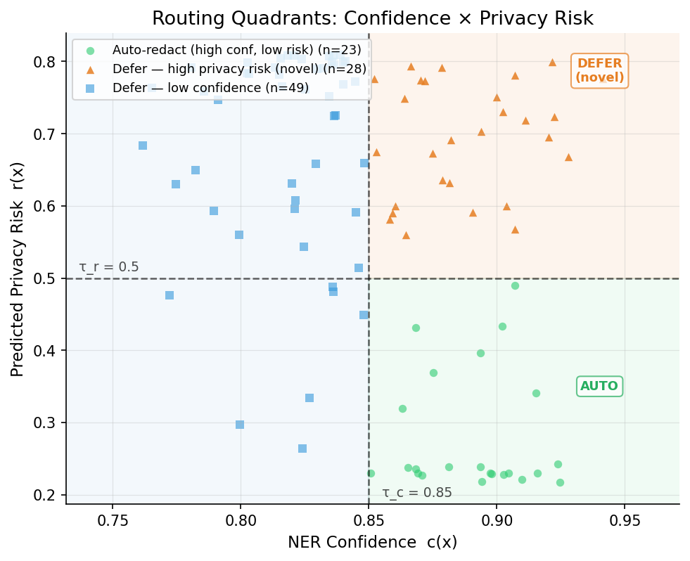
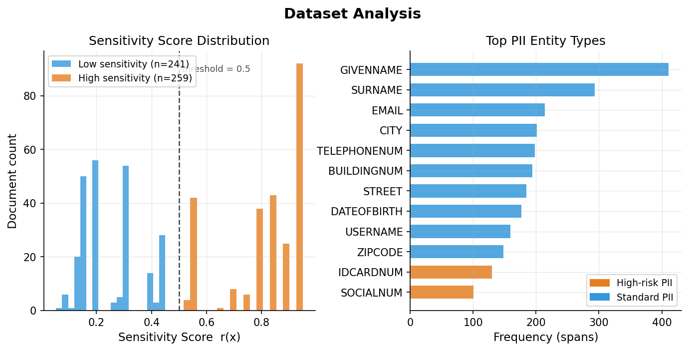
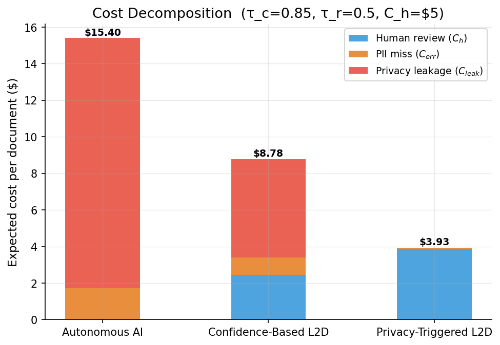
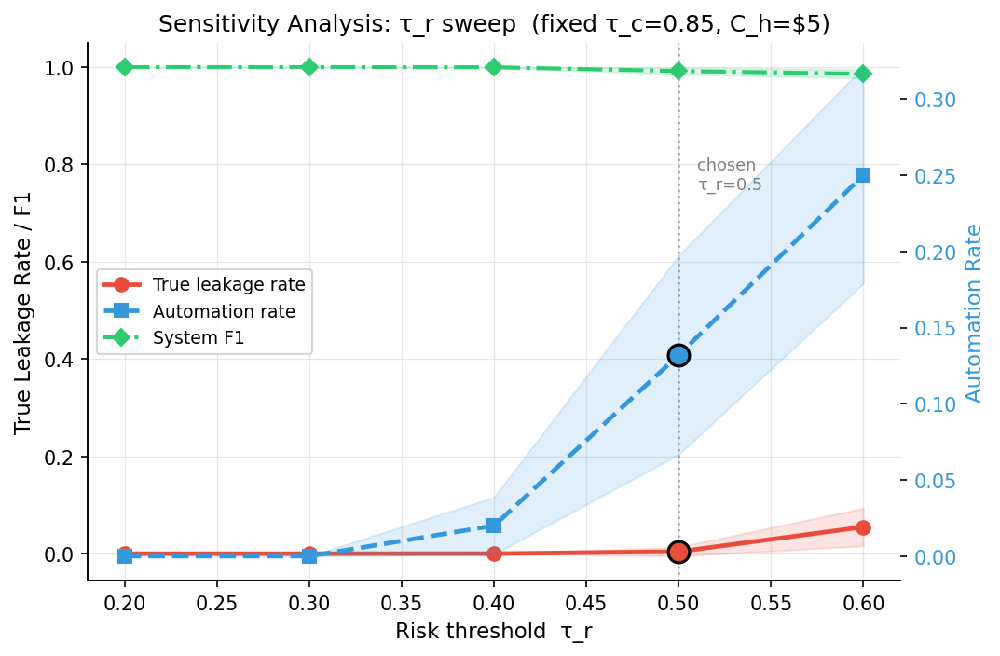

# Privacy-Triggered Deferral in Legal E-Discovery

**Context-Aware Human-AI Routing for PII Redaction**

Standard Learning-to-Defer (L2D) systems route documents to human reviewers only when the AI model's confidence is low. This project demonstrates that confidence alone is insufficient in privacy-sensitive domains: a model can be highly confident in its PII redactions while the surrounding context still exposes the individual. We propose **Privacy-Triggered Deferral**, a dual-objective routing policy that defers when confidence is low **or** contextual privacy risk is high:

$$\text{Defer}(x) = \mathbb{1}[c(x) < \tau_c \;\lor\; r(x) > \tau_r]$$

## Key Results

| Policy | Automation | Leakage | System F1 | Cost/doc |
|--------|-----------|---------|-----------|----------|
| Autonomous AI | 100% | 100% | 0.883 | $15.40 |
| Confidence-Based L2D (τ_c=0.85) | 51% | 40.5% | 0.945 | $8.78 |
| **Privacy-Triggered L2D** (τ_c=0.85, τ_r=0.5) | 23% | **0.0%** | 0.988 | **$3.93** |

Privacy-triggered deferral achieves **zero leakage** while being **3.9x cheaper** than the autonomous baseline, because avoiding costly privacy leaks ($50/doc) outweighs the human review overhead ($5/doc).

## Architecture

A single multi-task DistilBERT model with two heads:

```
Input tokens --> DistilBERT Encoder (768-dim)
                    |-- NER Head: Linear(768->2)       --> per-token redact/keep
                    |-- Risk Head: Linear(768->128->1)  --> document-level risk r(x)
```

The **NER head** produces redaction predictions and a confidence score `c(x)`. The **Risk head** predicts document-level privacy sensitivity `r(x)`. Both are trained jointly with equal-weighted loss.

## Project Structure

```
ediscovery-l2d/
├── data/
│   ├── prepare_data.py            # Download dataset, build word-level PII masks
│   └── documents.jsonl            # 500 processed documents
├── models/
│   ├── multitask_model.py         # MultiTaskRedactor model definition
│   └── train.py                   # Training loop (3 epochs, joint NER + risk loss)
├── pipeline/
│   ├── redactor.py                # Single-document inference
│   └── router.py                  # Three routing policies
├── evaluate/
│   └── metrics.py                 # Automation rate, leakage, F1, cost decomposition
├── experiments/
│   ├── run_experiment.py          # Full parameter sweep (155 configurations)
│   ├── results.csv                # Experiment results
│   └── predictions.json           # Per-document model predictions
├── plots/
│   ├── plot_pareto.py             # Pareto frontier plots
│   ├── plot_paper.py              # Publication figures (Figs 1-6)
│   └── figures/                   # Generated figures
├── paper.md                       # Full paper draft
├── project.md                     # Project specification
└── requirements.txt
```

## Setup & Reproduction

**Requirements:** Python 3.10+, ~4 GB disk (for dataset + model).

```bash
# 1. Clone and install
git clone https://github.com/etharhamid/Privacy-Triggered-Deferral-in-Legal-E-Discovery.git
cd Privacy-Triggered-Deferral-in-Legal-E-Discovery
python -m venv .venv && source .venv/bin/activate
pip install -r requirements.txt

# 2. Prepare data (downloads ai4privacy/pii-masking-400k, ~2 min)
python data/prepare_data.py

# 3. Train model (~5 min on CPU, ~1 min on GPU)
python models/train.py

# 4. Run experiments (generates results.csv + predictions.json)
python experiments/run_experiment.py

# 5. Generate figures
python -m plots.plot_pareto
python -m plots.plot_paper
```

> **Note:** `models/checkpoint.pt` is excluded from the repo due to GitHub's 100 MB limit. Run step 3 to regenerate it.

## Figures

| | |
|:---:|:---:|
|  |  |
| **Fig 1.** Routing quadrants from actual model predictions. The "novel" upper-right region (high confidence, high risk) is only caught by privacy-triggered deferral. | **Fig 2.** Dataset sensitivity distribution and PII type frequencies from the ai4privacy/pii-masking-400k dataset. |
|  |  |
| **Fig 5.** Cost decomposition: autonomous AI spends 89% on leakage penalties; privacy-triggered spends 98% on human review but is 3.9x cheaper overall. | **Fig 6.** Sweeping τ_r at fixed τ_c=0.85 reveals a "sweet spot" at τ_r=0.5: zero leakage with lowest cost. |

## Dataset

**Source:** [ai4privacy/pii-masking-400k](https://huggingface.co/datasets/ai4privacy/pii-masking-400k) — synthetic documents with character-level PII annotations across 17 entity types.

- 500 documents (400 train / 100 test)
- 2,630 PII spans across 17 types (GIVENNAME, SOCIALNUM, EMAIL, etc.)
- 51.8% classified as sensitive (score >= 0.5)

## Three Governance Strategies

| Strategy | Description | Mapping to Fabric Framework |
|----------|-------------|-----------------------------|
| **Autonomous AI** | Model auto-redacts everything, no human review | Full Autonomy |
| **Confidence-Based L2D** | Defer if NER confidence < τ_c | Standard Selective Prediction |
| **Privacy-Triggered L2D** | Defer if confidence < τ_c **or** risk > τ_r | Conditionally Autonomous AI |

## Citation

If you use this work, please cite:

```
@misc{privacy-triggered-deferral-2025,
  title={Privacy-Triggered Deferral in Legal E-Discovery: Context-Aware Human-AI Routing for PII Redaction},
  author={Ethar Hamid},
  year={2025},
  url={https://github.com/etharhamid/Privacy-Triggered-Deferral-in-Legal-E-Discovery}
}
```

## License

This project is for academic/research purposes.
